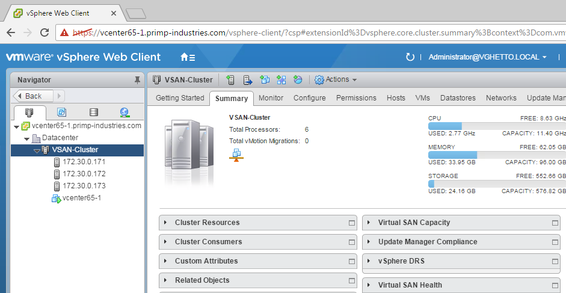

# vGhetto Automated vSphere Lab Deployment

## Table of Contents

* [Description](#description)
* [Changelog](#changelog)
* [Requirements](#requirements)
* [Supported Deployments](#supported-deployments)
* [Scripts](#scripts)
* [Configuration](#configuration)
* [Logging](#logging)
* [Verification](#verification)
* [Sample Execution](#sample-execution)

## Description

Automated deployment of a fully functional vSphere 6.0u2 or 6.5 environment that includes a set of Nested ESXi Virtual Appliance(s) configured w/vSAN as well as a vCenter Server Appliance (VCSA) using PowerCLI. For information, you can refer to this blog post [here](http://www.virtuallyghetto.com/2016/11/vghetto-automated-vsphere-lab-deployment-for-vsphere-6-0u2-vsphere-6-5.html) for more details.

## Changelog

* **11/22/16**
  * Automatically handle Nested ESXi on vSAN

* **01/20/17**
  * Resolved "Another task in progress" thanks to Jason M

* **02/12/17**

  * Support for deploying to VC Target
  * Support for enabling SSH on VCSA
  * Added option to auto-create vApp Container for VMs
  * Added pre-check for required files

* **02/17/17**

  * Added missing dvFilter param to eth1 (missing in Nested ESXi OVA)

* **02/21/27**

  * Support for deploying NSX 6.3 & registering with vCenter Server
  * Support for updating Nested ESXi VM to ESXi 6.5a (required for NSX 6.3)
  * Support for VDS + VXLAN VMkernel configuration (required for NSX 6.3)
  * Support for "Private" Portgroup on eth1 for Nested ESXi VM used for VXLAN traffic (required for NSX 6.3)
  * Support for both Virtual & Distributed Portgroup on $VMNetwork
  * Support for adding ESXi hosts into VC using DNS name (disabled by default)
  * Added CPU/MEM/Storage resource requirements in confirmation screen

## Requirements
* 1 x Physical ESXi host or vCenter Server running at least vSphere 6.0u2 or later
* Windows system
* [PowerCLI 6.5 R1](https://my.vmware.com/group/vmware/details?downloadGroup=PCLI650R1&productId=568)
* [PowerNSX](https://github.com/vmware/powernsx) installed and loaded (required if you plan to do NSX 6.3 deployment)
* vCenter Server Appliance (VCSA) 6.0 or 6.5 extracted ISO
* Nested ESXi [6.0](http://www.virtuallyghetto.com/2015/12/deploying-nested-esxi-is-even-easier-now-with-the-esxi-virtual-appliance.html) or [6.5](http://www.virtuallyghetto.com/2016/11/esxi-6-5-virtual-appliance-is-now-available.html) Virtual Appliance OVA
* [NSX 6.3 OVA](https://my.vmware.com/web/vmware/details?downloadGroup=NSXV_630&productId=417&rPId=14427) (optional)
  * [ESXi 6.5a offline patch bundle](https://my.vmware.com/web/vmware/details?downloadGroup=ESXI650A&productId=614&rPId=14229) (extracted)

## Supported Deployments

The scripts support deploying both a vSphere 6.0 Update 2 as well as vSphere 6.5 environment and there are two types of deployments for each:
* **Standard** - All VMs are deployed directly to the physical ESXi host
* **Self Managed** - Only the Nested ESXi VMs are deployed to physical ESXi host. The VCSA is then bootstrapped onto the first Nested ESXi VM

Here is a quick diagram to help illustrate the two deployment scenarios. The pESXi in gray is what you already have deployed which must be running at least ESXi 6.0 Update 2. The rest of the boxes is what the scripts will deploy. In the "Standard" deployment, three Nested ESXi VMs will be deployed to the pESXi host and configured with vSAN. The VCSA will also be deployed directly to the pESXi host and the vCenter Server will be configured to add the three Nested ESXi VMs into its inventory. This is a pretty straight forward and basic deployment, it should not surprise anyone. The "Self Managed" deployment is simliar, however the biggest difference is that rather than the VCSA being deployed directly to the pESXi host like the "Standard" deployment, it will actually be running within the Nested ESXi VM. The way that this deployment scenario works is that we will still deploy three Nested ESXi VM onto the pESXi host, however, the first Nested ESXi VM will be selected as a ["Bootstrap"](http://www.virtuallyghetto.com/2013/09/how-to-bootstrap-vcenter-server-onto_9.html) node which we will then construct a single-node vSAN to then deploy the VCSA. Once the vCenter Server is setup, we will then add the remainder Nested ESXi VMs into its inventory.


## Scripts
| Script Function | Script Download |
|-----------------|-----------------|
| vSphere 6.5 Standard Deployment | [vsphere-6.5-vghetto-standard-lab-deployment.ps1](vsphere-6.5-vghetto-standard-lab-deployment.ps1) |
| vSphere 6.0u2 Standard Deployment | [vsphere-6.0-vghetto-standard-lab-deployment.ps1](vsphere-6.0-vghetto-standard-lab-deployment.ps1) |
| vSphere 6.5 Self Managed Deployment | [vsphere-6.0-vghetto-self-manage-lab-deployment.ps1](vsphere-6.0-vghetto-self-manage-lab-deployment.ps1) |
| vSphere 6.0u2 Self Managed Deployment | [vsphere-6.5-vghetto-self-manage-lab-deployment.ps1](vsphere-6.5-vghetto-self-manage-lab-deployment.ps1) |

## Configuration

This section describes the location of the files required for deployment. The first two are mandatory for the basic deployment. For advanced deployments such as NSX 6.3, you will need to download additional files and below are examples of what is required.

```console
$NestedESXiApplianceOVA = "C:\Users\primp\Desktop\Nested_ESXi6.5_Appliance_Template_v1.ova"
$VCSAInstallerPath = "C:\Users\primp\Desktop\VMware-VCSA-all-6.5.0-4944578"
$NSXOVA =  "C:\Users\primp\Desktop\VMware-NSX-Manager-6.3.0-5007049.ova"
$ESXi65aOfflineBundle = "C:\Users\primp\Desktop\ESXi650-201701001\vmw-ESXi-6.5.0-metadata.zip"
```

This section describes the credentials to your physical ESXi server or vCenter Server in which the vSphere lab environment will be deployed to:
```console
$VIServer = "himalaya.primp-industries.com"
$VIUsername = "root"
$VIPassword = "vmware123"
```

This section describes whether your deployment environment (destination) will be an ESXi host or a vCenter Server. You will need to specify either **ESXI** or **VCENTER** keyword:
```console
$DeploymentTarget = "ESXI"
```

This section defines the number of Nested ESXi VMs to deploy along with their associated IP Address(s). The names are merely the display name of the VMs when deployed. At a minimum, you should deploy at least three hosts, but you can always add additional hosts and the script will automatically take care of provisioning them correctly.
```console
$NestedESXiHostnameToIPs = @{
"vesxi65-1" = "172.30.0.171"
"vesxi65-2" = "172.30.0.172"
"vesxi65-3" = "172.30.0.173"
}
```

This section describes the resources allocated to each of the Nested ESXi VM(s). Depending on the deployment type, you may need to increase the resources. For Memory and Disk configuration, the unit is in GB.
```console
$NestedESXivCPU = "2"
$NestedESXivMEM = "6"
$NestedESXiCachingvDisk = "4"
$NestedESXiCapacityvDisk = "8"
```

This section describes the VCSA deployment configuration such as the VCSA deployment size, Networking & SSO configurations. If you have ever used the VCSA CLI Installer, these options should look familiar.
```console
$VCSADeploymentSize = "tiny"
$VCSADisplayName = "vcenter65-1"
$VCSAIPAddress = "172.30.0.170"
$VCSAHostname = "vcenter65-1.primp-industries.com" #Change to IP if you don't have valid DNS
$VCSAPrefix = "24"
$VCSASSODomainName = "vghetto.local"
$VCSASSOSiteName = "virtuallyGhetto"
$VCSASSOPassword = "VMware1!"
$VCSARootPassword = "VMware1!"
$VCSASSHEnable = "true"
```

This section describes the location as well as the generic networking settings applied to BOTH the Nested ESXi VM and VCSA.
```console
$VirtualSwitchType = "VDS" # VSS or VDS for both $VMNetwork & $PrivateVXLANVMNetwork
$VMNetwork = "dv-access333-dev"
$VMDatastore = "himalaya-local-SATA-dc3500-2"
$VMNetmask = "255.255.255.0"
$VMGateway = "172.30.0.1"
$VMDNS = "172.30.0.100"
$VMNTP = "pool.ntp.org"
$VMPassword = "vmware123"
$VMDomain = "primp-industries.com"
$VMSyslog = "172.30.0.170"
# Applicable to Nested ESXi only
$VMSSH = "true"
$VMVMFS = "false"
# Applicable to VC Deployment Target only
$VMCluster = "Primp-Cluster"
```

This section describes the configuration of the new vCenter Server from the deployed VCSA.
```console
$NewVCDatacenterName = "Datacenter"
$NewVCVSANClusterName = "VSAN-Cluster"
```

This section describes the NSX configuration if you choose to deploy which will require you to set $DeployNSX property to 1 and fill out all fields.
```console
$DeployNSX = 0
$NSXvCPU = "2" # Reconfigure NSX vCPU
$NSXvMEM = "8" # Reconfigure NSX vMEM (GB)
$NSXDisplayName = "nsx63-1"
$NSXHostname = "nsx63-1.primp-industries.com"
$NSXIPAddress = "172.30.0.250"
$NSXNetmask = "255.255.255.0"
$NSXGateway = "172.30.0.1"
$NSXSSHEnable = "true"
$NSXCEIPEnable = "false"
$NSXUIPassword = "VMw@re123!"
$NSXCLIPassword = "VMw@re123!"
```

This section describes the VDS and VXLAN configurations which is required for NSX deployment. The only mandatory field here is $PrivateVXLANVMnetwork which is a private portgroup that must already exists which will be used to connect the second network adapter of the Nested ESXi VM for VXLAN traffic. You do not need a routable portgroup and the other properties can be left as default or you can modify them if you wish.
```console
# VDS / VXLAN Configurations
$PrivateVXLANVMNetwork = "dv-private-network" # Existing Portgroup
$VDSName = "VDS-6.5"
$VXLANDVPortgroup = "VXLAN"
$VXLANSubnet = "172.16.66."
$VXLANNetmask = "255.255.255.0"
```

This section describes some advanced options for the deployment. Th first setting adds the ESXi hosts into vCenter Server using DNS names (must have both forward/reverse DNS working in your environment). The second option will upgrade the Nested ESXi 6.5 VMs to ESXi 6.5a which is required if you are deploying NSX 6.3 or if you just want to run the latest version of ESXi, you can also enable this. Both of these settings are disabled by default
```console
# Set to 1 only if you have DNS (forward/reverse) for ESXi hostnames
$addHostByDnsName = 0
# Upgrade vESXi hosts to 6.5a
$upgradeESXiTo65a = 0
```

Once you have saved your changes, you can now run the PowerCLI script as you normally would.

## Logging

There is additional verbose logging that outputs as a log file in your current working directory either **vsphere60-vghetto-lab-deployment.log** or **vsphere65-vghetto-lab-deployment.log** depending on the deployment you have selected.

## Verification

Once you have saved all your changes, you can then run the script. You will be provided with a summary of what will be deployed and you can verify that everything is correct before attempting the deployment. Below is a screenshot on what this would look like:


## Sample Executions

Here is an example of running a vSphere 6.5 "Standard" deployment including NSX 6.3:


Here is an example of running a vSphere 6.5 "Self Managed" deployment:


If everything is succesful, you can now login to your new vCenter Server and you should either see the following for a **"Standard"** deployment:


or the following for **"Self Managed"** deployment:


